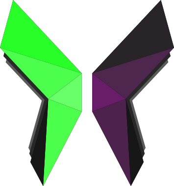

<div align="center">
  <a href="https://github.com/ProjNull/Praeteritum">
    
  </a>
</div>
<h1 align="center">Welcome to Praeteritum 👋</h1>
<p>
  
  <a href="https://github.com/ProjNull/Praeteritum/blob/master/LICENSE.md" target="_blank">
    
  </a>
</p>

> A web application to help orchestrate retrospective

## Install

```sh
docker-compose up -d
```

## Usage

```sh
Head to http://localhost:80 to view the running containerized application
```

## Author

👤 **{NULL}**

* Website: projnull.mobilex1122.eu
* Github: [@ProjNull](https://github.com/ProjNull)

## 🤝 Contributing

Contributions, issues and feature requests are welcome!<br />Feel free to check [issues page](https://github.com/ProjNull/Praeteritum/issues). 

## Show your support

Give a ⭐️ if this project helped you!

## 📝 License

Copyright © 2024 [ProjNull](https://github.com/ProjNull).<br />
This project is [MIT License](https://github.com/ProjNull/Praeteritum/blob/master/LICENSE.md) licensed.

***
_This README was generated with ❤️ by [readme-md-generator](https://github.com/kefranabg/readme-md-generator)_
